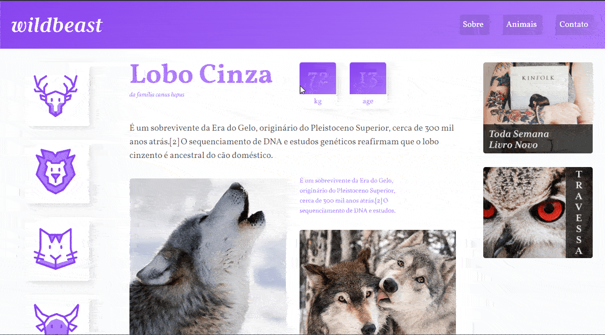

# Wildbeast

Projeto do curso <a href="https://www.origamid.com/curso/css-grid-layout/">CSS Grid Layout</a> da <a href="https://www.origamid.com/">origamid.com</a>.

Projeto realizado com o intuito de praticar a produção de páginas na web, se utilizando de HTML e colocando em prática a nova especificação CSS Grid Layout.

Me siga no <a href="https://www.linkedin.com/in/jose-de-souza/">Linkedin</a>